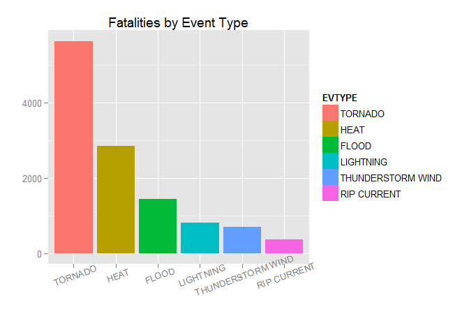
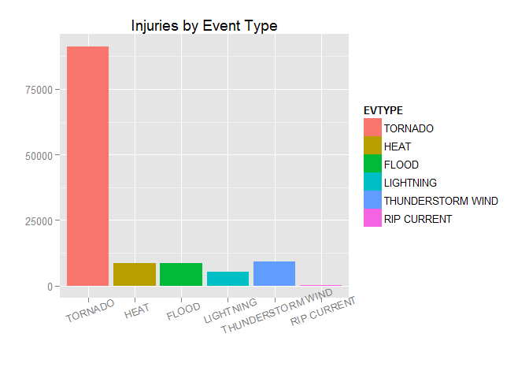
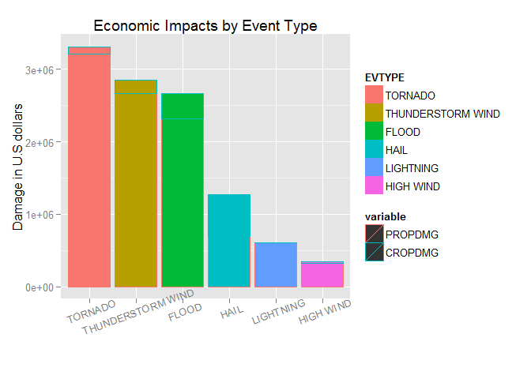

# Reproducible Research: Peer Assessment 2

# Title that briefly summarizes data analysis

# Synopsis

The [Storm Data](http://d396qusza40orc.cloudfront.net/repdata%2Fdata%2FStormData.csv.bz2) [47Mb] from the NOAA has been used to answer following questions:

1. Across the United States, which types of events (as indicated in the EVTYPE variable) are most harmful with respect to population health?

2. Across the United States, which types of events have the greatest economic consequences?

After some exploratory analisys it was found

# Data Processing

## Loading the storm data


```r
# Trying to load dependencies
library(data.table)
library(ggplot2)
library(stringi)
library(reshape2)
```


```r
temp.f <- tempfile(fileext=".csv.bz2")
download.file("http://d396qusza40orc.cloudfront.net/repdata%2Fdata%2FStormData.csv.bz2", destfile = temp.f)
storm.data <- data.table(read.csv(temp.f))
unlink(temp.f)
```

## First look at the loaded data


```r
str(storm.data)
```

```
## Classes 'data.table' and 'data.frame':	902297 obs. of  37 variables:
##  $ STATE__   : num  1 1 1 1 1 1 1 1 1 1 ...
##  $ BGN_DATE  : Factor w/ 16335 levels "1/1/1966 0:00:00",..: 6523 6523 4242 11116 2224 2224 2260 383 3980 3980 ...
##  $ BGN_TIME  : Factor w/ 3608 levels "00:00:00 AM",..: 272 287 2705 1683 2584 3186 242 1683 3186 3186 ...
##  $ TIME_ZONE : Factor w/ 22 levels "ADT","AKS","AST",..: 7 7 7 7 7 7 7 7 7 7 ...
##  $ COUNTY    : num  97 3 57 89 43 77 9 123 125 57 ...
##  $ COUNTYNAME: Factor w/ 29601 levels "","5NM E OF MACKINAC BRIDGE TO PRESQUE ISLE LT MI",..: 13513 1873 4598 10592 4372 10094 1973 23873 24418 4598 ...
##  $ STATE     : Factor w/ 72 levels "AK","AL","AM",..: 2 2 2 2 2 2 2 2 2 2 ...
##  $ EVTYPE    : Factor w/ 985 levels "   HIGH SURF ADVISORY",..: 834 834 834 834 834 834 834 834 834 834 ...
##  $ BGN_RANGE : num  0 0 0 0 0 0 0 0 0 0 ...
##  $ BGN_AZI   : Factor w/ 35 levels "","  N"," NW",..: 1 1 1 1 1 1 1 1 1 1 ...
##  $ BGN_LOCATI: Factor w/ 54429 levels "","- 1 N Albion",..: 1 1 1 1 1 1 1 1 1 1 ...
##  $ END_DATE  : Factor w/ 6663 levels "","1/1/1993 0:00:00",..: 1 1 1 1 1 1 1 1 1 1 ...
##  $ END_TIME  : Factor w/ 3647 levels ""," 0900CST",..: 1 1 1 1 1 1 1 1 1 1 ...
##  $ COUNTY_END: num  0 0 0 0 0 0 0 0 0 0 ...
##  $ COUNTYENDN: logi  NA NA NA NA NA NA ...
##  $ END_RANGE : num  0 0 0 0 0 0 0 0 0 0 ...
##  $ END_AZI   : Factor w/ 24 levels "","E","ENE","ESE",..: 1 1 1 1 1 1 1 1 1 1 ...
##  $ END_LOCATI: Factor w/ 34506 levels "","- .5 NNW",..: 1 1 1 1 1 1 1 1 1 1 ...
##  $ LENGTH    : num  14 2 0.1 0 0 1.5 1.5 0 3.3 2.3 ...
##  $ WIDTH     : num  100 150 123 100 150 177 33 33 100 100 ...
##  $ F         : int  3 2 2 2 2 2 2 1 3 3 ...
##  $ MAG       : num  0 0 0 0 0 0 0 0 0 0 ...
##  $ FATALITIES: num  0 0 0 0 0 0 0 0 1 0 ...
##  $ INJURIES  : num  15 0 2 2 2 6 1 0 14 0 ...
##  $ PROPDMG   : num  25 2.5 25 2.5 2.5 2.5 2.5 2.5 25 25 ...
##  $ PROPDMGEXP: Factor w/ 19 levels "","-","?","+",..: 17 17 17 17 17 17 17 17 17 17 ...
##  $ CROPDMG   : num  0 0 0 0 0 0 0 0 0 0 ...
##  $ CROPDMGEXP: Factor w/ 9 levels "","?","0","2",..: 1 1 1 1 1 1 1 1 1 1 ...
##  $ WFO       : Factor w/ 542 levels ""," CI","$AC",..: 1 1 1 1 1 1 1 1 1 1 ...
##  $ STATEOFFIC: Factor w/ 250 levels "","ALABAMA, Central",..: 1 1 1 1 1 1 1 1 1 1 ...
##  $ ZONENAMES : Factor w/ 25112 levels "","                                                                                                                               "| __truncated__,..: 1 1 1 1 1 1 1 1 1 1 ...
##  $ LATITUDE  : num  3040 3042 3340 3458 3412 ...
##  $ LONGITUDE : num  8812 8755 8742 8626 8642 ...
##  $ LATITUDE_E: num  3051 0 0 0 0 ...
##  $ LONGITUDE_: num  8806 0 0 0 0 ...
##  $ REMARKS   : Factor w/ 436781 levels "","-2 at Deer Park\n",..: 1 1 1 1 1 1 1 1 1 1 ...
##  $ REFNUM    : num  1 2 3 4 5 6 7 8 9 10 ...
##  - attr(*, ".internal.selfref")=<externalptr>
```

So the variables of interest are:

1. *EVTYPE* - Event type (text).

2. *FATALITIES* - Death count. Relates to the population health question.

3. *INJURIES* - Injuries count. Relates to the population health question.

4. *PROPDMG* - Property damage estimation (in U.S. dollars). Relates to the economic consequences question.

5. *CROPDMG* - Crop damage estimation (in U.S. dollars). Relates to the economic consequences question.

Are there any empty values?


```r
ifelse(any(is.na(storm.data$EVTYPE),
           is.na(storm.data$FATALITIES),
           is.na(storm.data$INJURIES),
           is.na(storm.data$PROPDMG),
           is.na(storm.data$CROPDMG)), "YES", "NO")
```

```
## [1] "NO"
```

How many different types of events exist?


```r
original.event.type.count <- length(levels(factor(storm.data$EVTYPE)))
print(original.event.type.count)
```

```
## [1] 985
```

Seem to be event type variable is not clean enough to be used as classifier. There are a lot of typos, semantic duplicates, and mixed values.

## Cleaning event type variable


```r
invisible({
    storm.data[, EVTYPE := stri_trim_both(EVTYPE)]
    storm.data[, EVTYPE := stri_trans_toupper(EVTYPE)]
    # Removing trailing separator symbols
    storm.data[, EVTYPE := stri_replace_all_regex(EVTYPE, "[/\\-\\.;]+$", "")]
    # Replacing different variants of separators by / symbol
    storm.data[, EVTYPE := stri_replace_all_regex(EVTYPE, "\\s*(/|\\\\|&|;)\\s*", "/")]
    storm.data[, EVTYPE := stri_replace_all_regex(EVTYPE, "\\s+AND\\s+", "/")]
    # Question marks should be replaced with NONE
    storm.data[, EVTYPE := stri_replace_all_fixed(EVTYPE, "?", "NONE")]
    # Removing some semantic duplicates
    storm.data[, EVTYPE := stri_replace_all_regex(EVTYPE, "(WINTRY|WINTERY)", "WINTER")]
    # Moving unnecessary event types to OTHER category
    storm.data[, EVTYPE := stri_replace_all_regex(EVTYPE, ".*(SUMMARY).*", "OTHER")]
    # Replacing sequences of white space symbols by only one space symbol
    storm.data[, EVTYPE := stri_replace_all_regex(EVTYPE, "\\s+", " ")]
})
```

How many event types was rejected during cleaning stage?


```r
original.event.type.count - length(levels(factor(storm.data$EVTYPE)))
```

```
## [1] 213
```

Computing the *total number of deaths* per event type:


```r
fatalities.by.type <- storm.data[, sum(FATALITIES), by = EVTYPE]
invisible({
    fatalities.by.type[, FATALITIES := V1]
    fatalities.by.type[, V1 := NULL]
})
```

Computing the *total number of injuries* per event type:


```r
injuries.by.type <- storm.data[, sum(INJURIES), by = EVTYPE]
invisible({
    injuries.by.type[, INJURIES := V1]
    injuries.by.type[, V1 := NULL]
})
```

Merging *health impacts* and picking up most significant of them:


```r
health.impacts.by.type <- merge(fatalities.by.type, 
                                injuries.by.type,
                                by = "EVTYPE")
# Order by fatalities
health.impacts.by.type.top <- head(health.impacts.by.type[order(-FATALITIES)])
invisible({
    # Converting EVTYPE to factor with respect to ordering
    health.impacts.by.type.top[, EVTYPE := factor(EVTYPE, levels = EVTYPE)]
})
```

Computing the *total property damage* per event type:


```r
property.damage.by.type <- storm.data[, sum(PROPDMG), by = EVTYPE]
invisible({
    property.damage.by.type[, PROPDMG := V1]
    property.damage.by.type[, V1 := NULL]
})
```

Computing the *total crop damage* per event type:


```r
crop.damage.by.type <- storm.data[, sum(CROPDMG), by = EVTYPE]
invisible({
    crop.damage.by.type[, CROPDMG := V1]
    crop.damage.by.type[, V1 := NULL]
})
```

Merging *economic impacts* and picking up most significant of them:


```r
economic.impacts.by.type <- merge(property.damage.by.type,
                                  crop.damage.by.type,
                                  by = "EVTYPE")
# Order by total damage
economic.impacts.by.type.top <- head(economic.impacts.by.type[order(-(PROPDMG + CROPDMG))])
invisible({
    # Converting EVTYPE to factor with respect to ordering
    economic.impacts.by.type.top[, EVTYPE := factor(EVTYPE, levels = EVTYPE)]
})
```

# Results


```r
ggplot(health.impacts.by.type.top, aes(EVTYPE, FATALITIES, fill = EVTYPE)) +
    geom_bar(position = "dodge", stat = "identity") +
    labs(title = "Fatalities by Event Type", x = "", y = "") +
    theme(axis.text.x = element_text(angle = 10))
```

 


```r
ggplot(health.impacts.by.type.top, aes(EVTYPE, INJURIES, fill = EVTYPE)) +
    geom_bar(position = "dodge", stat = "identity") +
    labs(title = "Injuries by Event Type", x = "", y = "") +
    theme(axis.text.x = element_text(angle = 10))
```

 


```r
economic.impacts.melted <- melt(economic.impacts.by.type.top, id.vars = "EVTYPE")
ggplot(economic.impacts.melted, aes(EVTYPE, value, fill=EVTYPE, colour=variable)) +
    geom_bar(stat = "identity") +
    labs(title = "Economic Impacts by Event Type", x = "",
         y = "Damage in U.S dollars") +
    theme(axis.text.x = element_text(angle = 10))
```

 
